# RetireePlan

**Open-source Canadian financial & retirement planning — built for Canadians, by Canadians.**

RetireePlan is a self-hosted desktop and web application that gives individual investors the same depth of planning capability as expensive advisor-gated software. Model your complete financial life, run thousands of Monte Carlo simulations, optimize CPP/OAS timing, minimize lifetime taxes, and plot a confident path to retirement — all without sharing your data with anyone.

---

## ✨ Key Features

### 📊 Cash-Flow Projections
Year-by-year deterministic engine that tracks income, expenses, account growth, registered withdrawals, and taxes from today through your final planning year. Supports phased retirement, variable spending, and every Canadian registered account type.

### 🎲 Monte Carlo & Historical Simulations
Run 1,000-trial Monte Carlo simulations using normal, log-normal, or historical-bootstrap return distributions. Replay your plan against real TSX/S&P 500/bond/inflation data from 1970–2024. View fan charts, success-rate heatmaps, and survival-age histograms.

### 🍁 Deep Canadian Tax Engine
Federal + provincial brackets for all 13 provinces/territories. CPP/QPP, EI, OAS/GIS clawback, capital-gains inclusion rate, eligible dividend gross-up & credit, pension income splitting, RRIF minimum withdrawals, and departure tax for cross-border situations.

### 💡 Automated Insights Engine
A rule-based engine surfaces up to 5 ranked, dollar-quantified recommendations — RRSP meltdown opportunities, OAS clawback avoidance, TFSA room utilization, RRIF timeline alerts, CPP/OAS timing, and pension splitting. Integrated into the Dashboard and AppBar notification bell.

### 🏆 Retirement Readiness Score
A single 0–100 composite score weighted across Monte Carlo success rate (40%), income replacement ratio (25%), tax efficiency (20%), and account diversification (15%). Displayed as a gauge dial with component breakdown and actionable improvement suggestions.

### 📋 Plan Completeness Checklist
13-item checklist with per-category progress bars (Basics, Income, Accounts, Planning) and a plan quality % badge. Tells you exactly what's missing before you run projections.

### 🔄 What-If Scenarios
Create and compare multiple named scenarios side-by-side. The Compare page overlays projections, net worth curves, and tax summaries across any two plans at once.

### 🏠 Real Estate & Estate Planning
Model rental properties, principal-residence exemptions, and deemed-disposition tax on death. Estimate probate by province. Model beneficiary designations and inheritance events.

### 🌎 International (Canada/US)
Cross-border considerations: tax treaty rates, FBAR thresholds, departure tax, T1135, RRSP non-resident withholding, CPP/SS totalization.

### 🤖 AI Assistant
Context-aware chat that knows your household data. Pluggable between local Ollama (fully private) and GitHub Copilot SDK. Ask plain-English questions: *"At what age can I retire if I save $2,000 more per month?"*

### 📥 YNAB Integration
Pull real spending categories and transaction data directly from YNAB to ground your projections in actual spending behaviour rather than estimates.

### 📄 PDF / CSV Export
Full multi-scenario PDF report with embedded charts and a net-worth statement. CSV row-per-year export for spreadsheet power users.

### 🖥️ Desktop App (Electron)
A native macOS/Windows/Linux desktop application with:
- No server required — the API runs locally inside the app
- Multiple financial plans (profiles) in different folders
- One-click plan switching from the login screen
- Automatic daily backups, per-plan and isolated
- Packaged as a DMG (macOS), NSIS installer (Windows), or AppImage/deb (Linux)
- GitHub Actions CI builds installers for all three platforms automatically

---

## 🗺️ Roadmap

See the full gap analysis and proposal in [docs/ROADMAP-proposed-enhancements.md](docs/ROADMAP-proposed-enhancements.md).

| Theme | Feature | Status |
|---|---|---|
| Plan Health | Retirement Readiness Score | ✅ Shipped |
| Plan Health | Automated Insights Engine | ✅ Shipped |
| Plan Health | Plan Completeness Checklist | ✅ Shipped |
| Dashboard | Income Replacement Card | ✅ Shipped |
| Dashboard | Net Worth Timeline Sparkline | ✅ Shipped |
| Dashboard | Market Data / Assumptions Refresh | ✅ Shipped |
| Projections | Account Drawdown Animation | ✅ Shipped |
| Projections | Quick What-If Calculator | ✅ Shipped |
| Spending | Phased Retirement Spending Template | ✅ Shipped |
| Accounts | RRSP/TFSA Contribution Room Tracker | ✅ Shipped |
| Accounts | Asset Allocation Modeller | ✅ Shipped |
| Accounts | Real Estate & Rental Income | ✅ Shipped |
| Planning | Goals-Based Retirement View | ✅ Shipped |
| Planning | Milestone Templates | ✅ Shipped |
| Income | RRSP Meltdown Wizard | ✅ Shipped |
| Export | PDF Report Improvements | ✅ Shipped |
| Income | CPP Timing Optimizer | 🔜 Planned |
| Income | OAS Deferral + Clawback Optimizer | 🔜 Planned |
| Income | Pension Splitting Optimizer | 🔜 Planned |
| Income | GIS Planner | 🔜 Planned |
| Income | Spousal RRSP Optimizer | 🔜 Planned |
| Accounts | Defined Benefit Pension Deep-Dive | 🔜 Planned |
| Tax | TFSA vs. Non-Reg Withdrawal Optimizer | 🔜 Planned |
| Tax | Corporate Structure (HoldCo) | 🔜 Planned |
| Simulations | Withdrawal Order Optimizer | 🔜 Planned |
| Simulations | Bucket Strategy Modeller | 🔜 Planned |
| Simulations | Sequence-of-Returns Risk Visualizer | 🔜 Planned |
| Simulations | Life Insurance Needs Calculator | 🔜 Planned |
| Data | CRA My Account Data Import | 🔜 Planned |
| Data | Linked live account balances (Questrade/WS) | 🔜 Planned |
| Data | RDSP support | 🔜 Planned |
| Data | RESP Planner | 🔜 Planned |
| Desktop | Auto-update mechanism | 🔜 Planned |
| Desktop | Windows/Linux packaged installers | ✅ Shipped |

---

## 📸 Screenshots

| Login | Dashboard | Household |
|---|---|---|
| 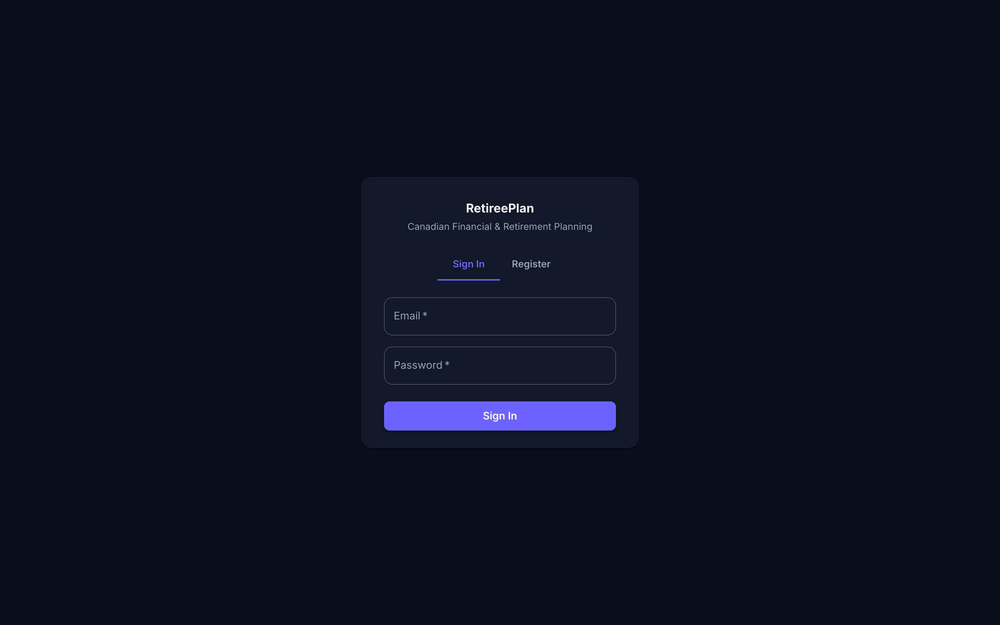 | 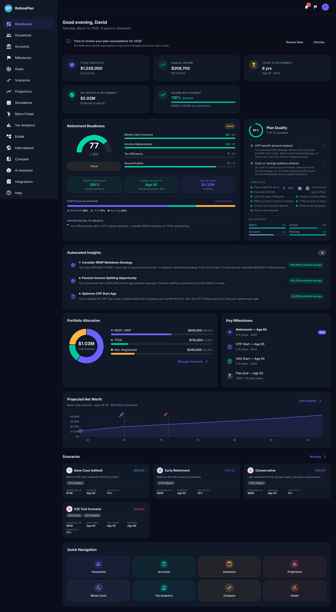 | 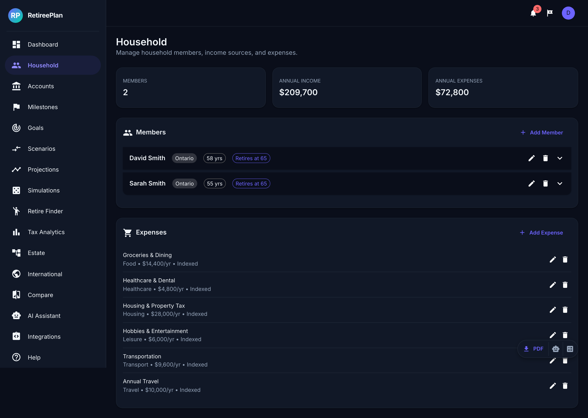 |

| Projections | Simulations | Tax Analytics |
|---|---|---|
| 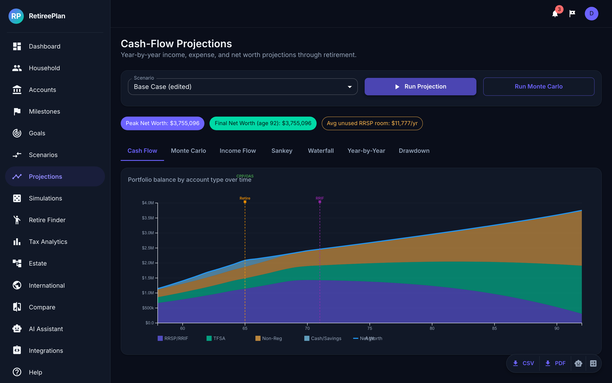 | 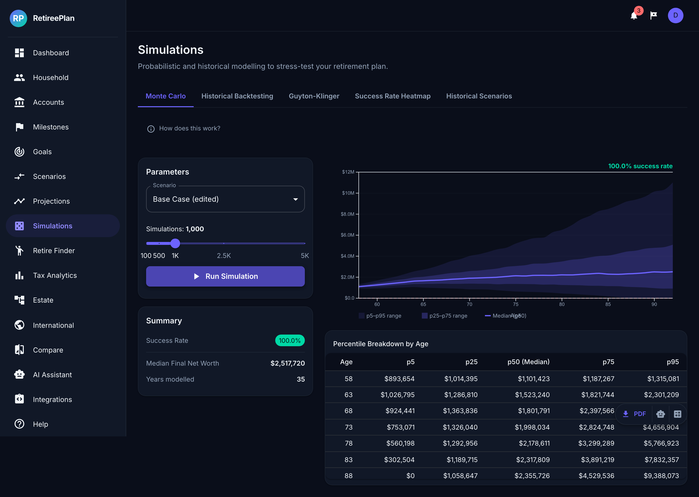 | 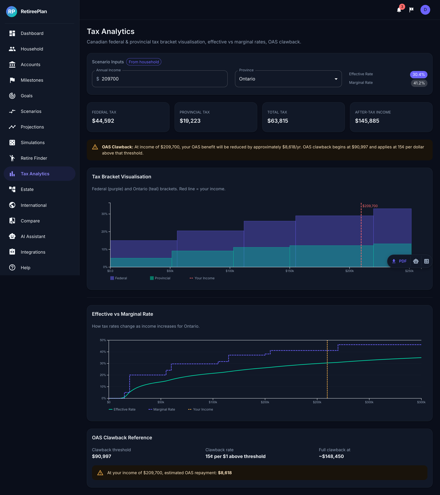 |

| Scenarios | Earliest Retire Finder | Compare |
|---|---|---|
| 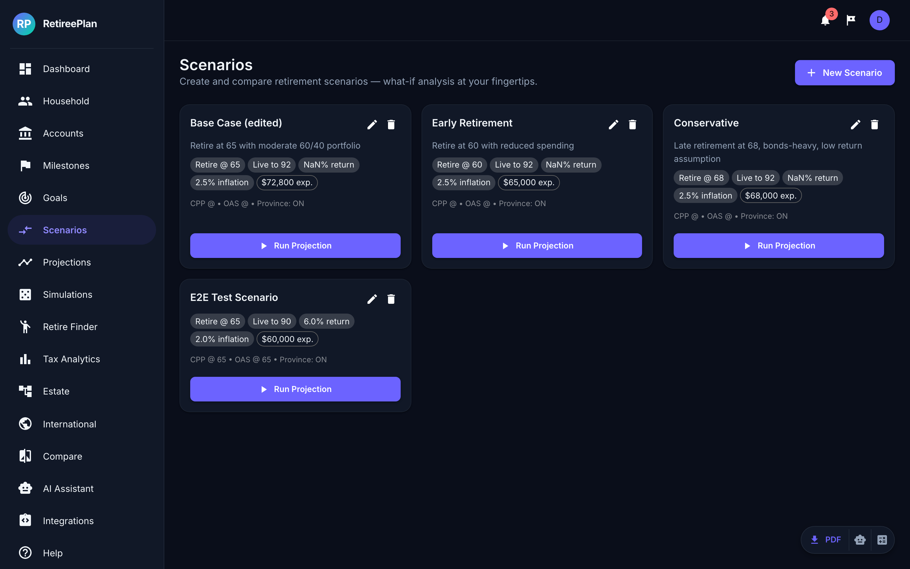 | 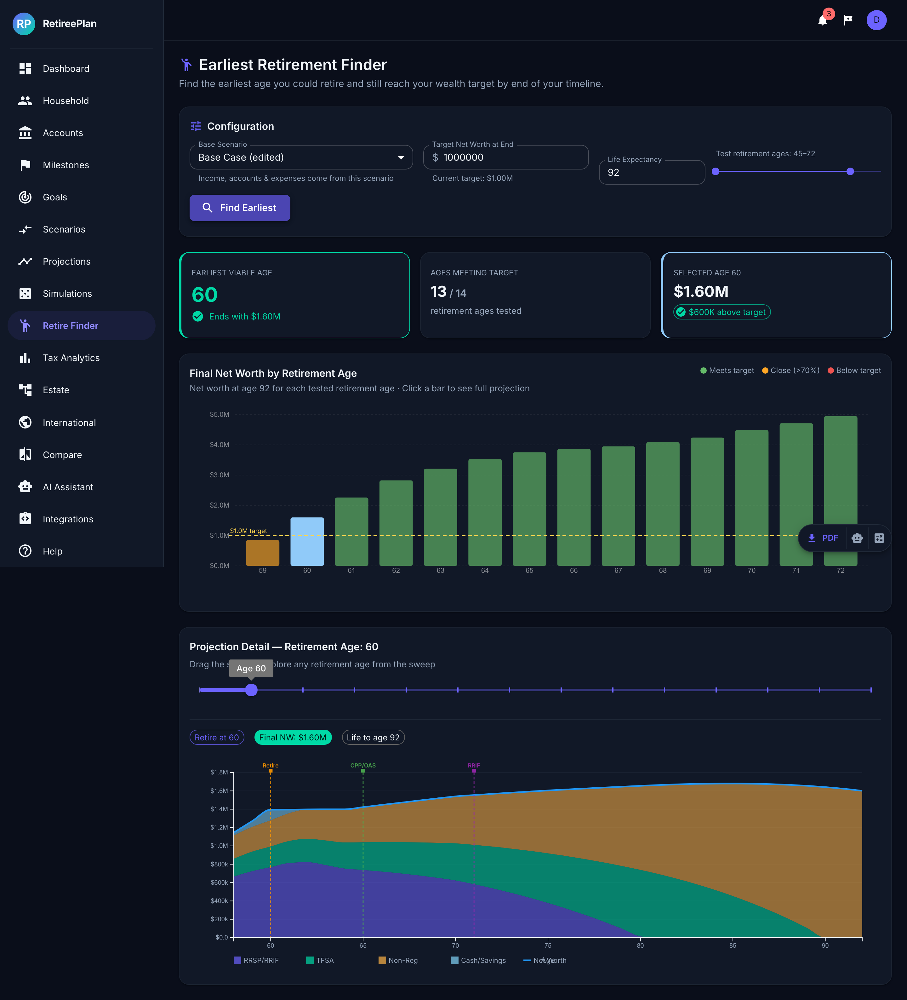 | 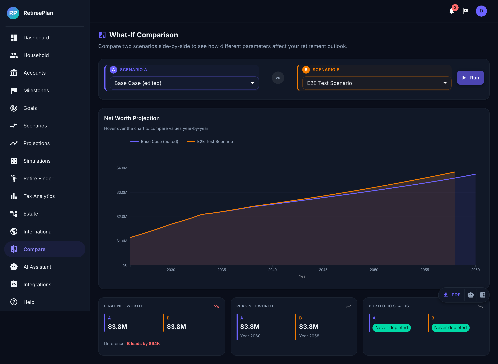 |

| Estate Planning | Accounts | Settings |
|---|---|---|
| 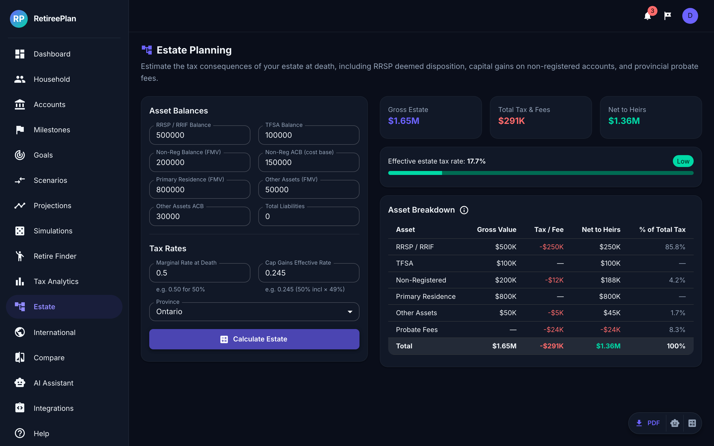 | 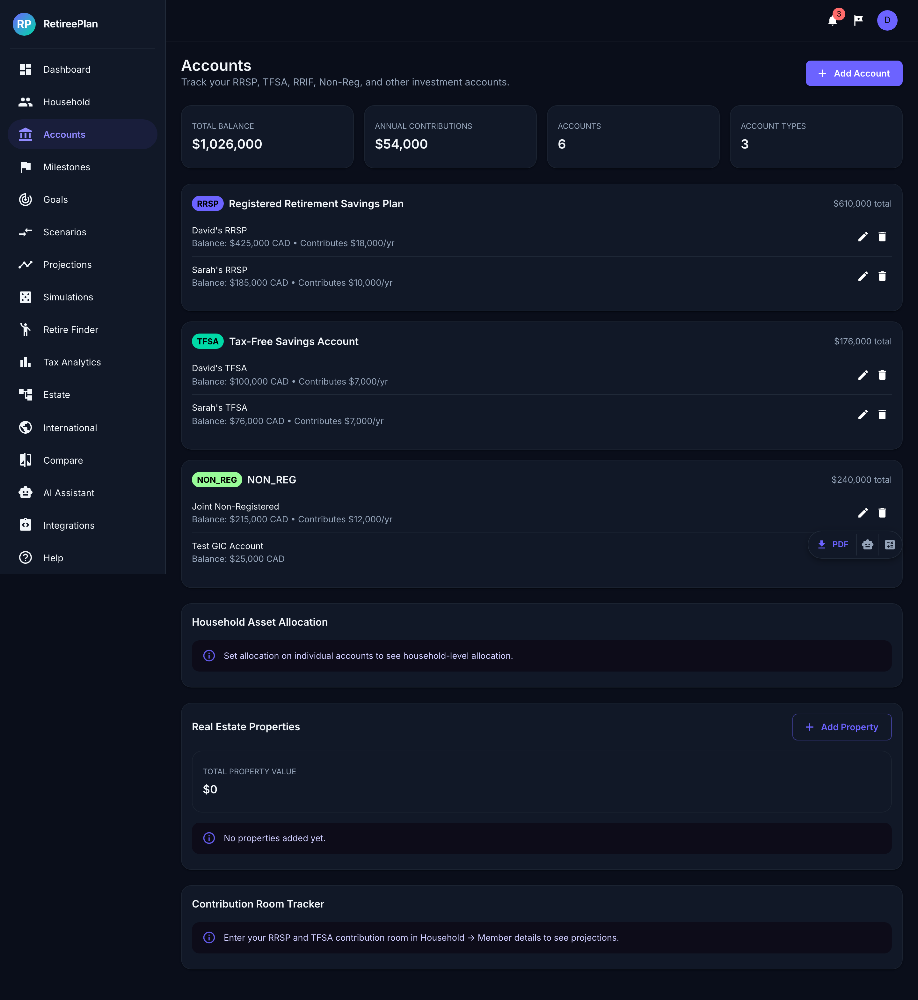 | 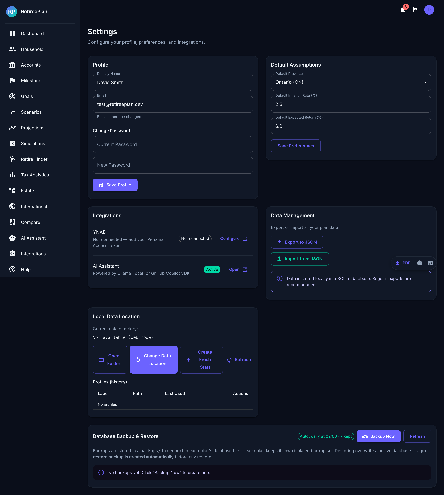 |

| AI Assistant | Integrations | International |
|---|---|---|
| 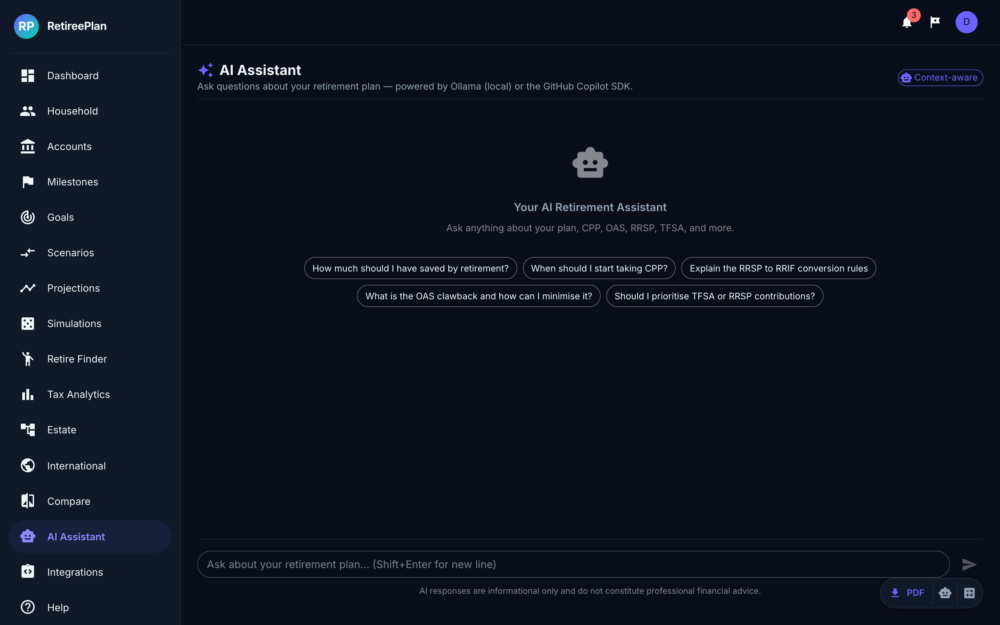 | 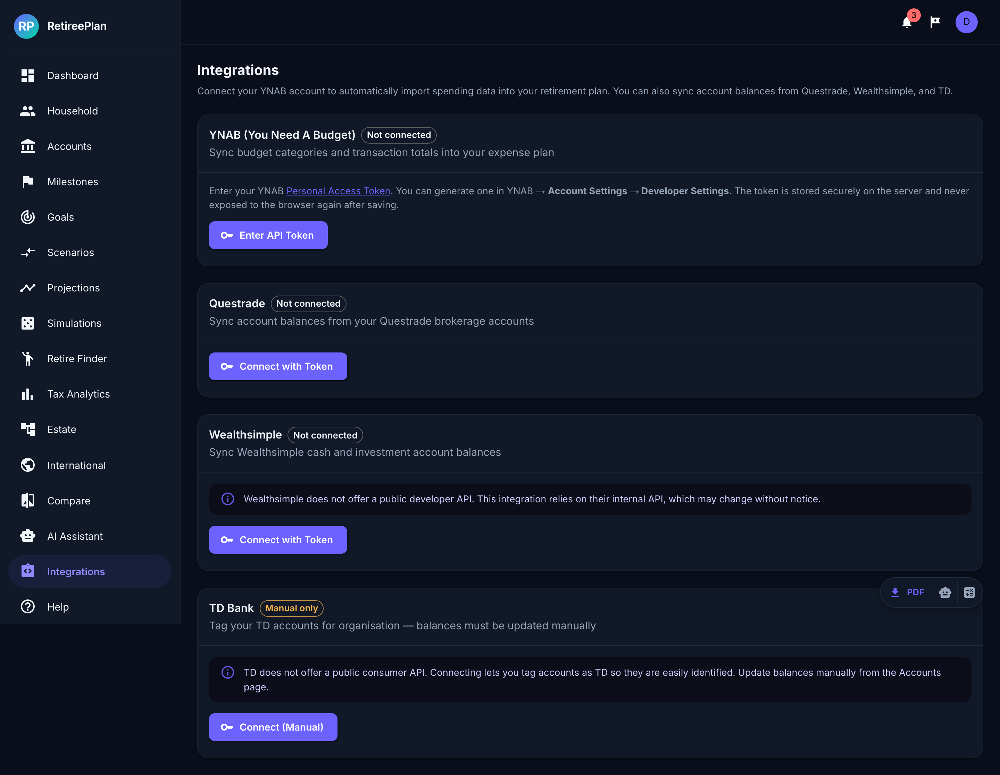 | 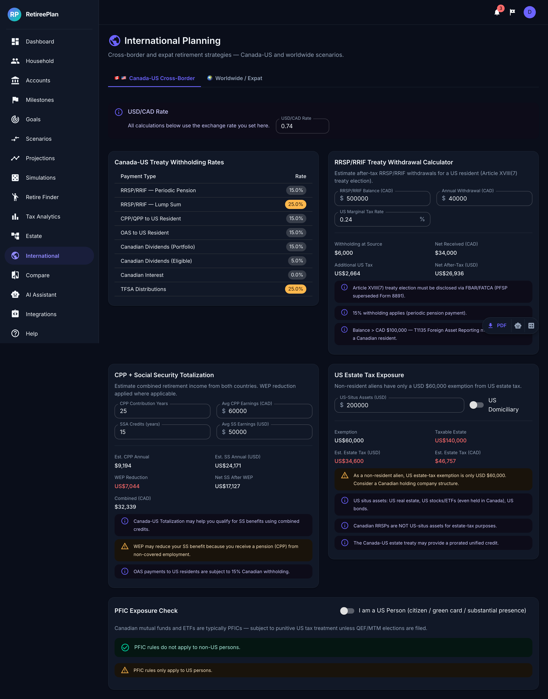 |

---

## 🚀 Quick Start

### Option A — Desktop App (Recommended for personal use)

Download the latest release for your platform from the [Releases page](../../releases).

- **macOS:** Open the `.dmg`, drag RetireePlan to Applications.
- **Windows:** Run the `.exe` installer.
- **Linux:** Use the `.AppImage`.

The app bundles its own API server — no Node.js or database setup required.

### Option B — Web / Development Mode

See the full [Installation & Developer Guide](docs/INSTALL.md).

**Prerequisites:** Node.js ≥ 24, npm ≥ 10

```bash
# 1. Clone
git clone https://github.com/your-org/retiree-plan.git
cd retiree-plan

# 2. Install dependencies
npm install

# 3. Set up environment
cp .env.example .env
# Edit .env — set JWT_SECRET and optionally YNAB_API_KEY

# 4. Initialize the database
npm run db:migrate
npm run db:generate

# 5. Start development servers (API + web in parallel)
npm run dev
```

The web UI opens at **http://localhost:5173** and the API at **http://localhost:3001**.

---

## 📁 Repository Layout

```
retiree-plan/
├── apps/
│   ├── api/              # NestJS 11 REST API (Prisma + SQLite/Postgres)
│   ├── web/              # React 19 + Vite 6 + MUI 6 single-page app
│   └── desktop/          # Electron 32 wrapper (bundles API + web)
├── packages/
│   ├── shared/           # Zod schemas, constants, shared TypeScript types
│   ├── finance-engine/   # Pure-TS tax, projection, and simulation engine
│   └── openapi/          # OpenAPI 3.1 spec + generated client types
├── prisma/               # Prisma schema, migrations, seed scripts, backup/restore
├── docs/                 # User guides, architecture docs, roadmap
├── e2e/                  # Playwright end-to-end tests
├── .github/              # CI/CD workflows (GitHub Actions)
└── scripts/              # Build helpers
```

---

## 🛠️ Tech Stack

| Layer | Technology |
|---|---|
| Language | TypeScript (strict) — frontend, backend, engine, desktop |
| Frontend | React 19, Vite 6, Material UI 6, D3.js 7, TanStack Query 5, React Router 7 |
| Backend | NestJS 11, Prisma 6, SQLite (dev / desktop), PostgreSQL (production) |
| Desktop | Electron 32, electron-builder 25 |
| Testing | Vitest + React Testing Library, Playwright (E2E) |
| CI | GitHub Actions |
| AI | Ollama (local) or GitHub Copilot SDK (pluggable) |
| Integrations | YNAB API v2, Questrade, Wealthsimple, TD |

---

## 📚 Documentation

| Document | Description |
|---|---|
| [Installation & Developer Guide](docs/INSTALL.md) | Full setup, environment variables, database, desktop build |
| [User Guide — Retirement Planning](docs/USER-GUIDE-retirement-planning.md) | End-user walkthrough of all planning workflows |
| [System Overview](docs/guide-00-system-overview.md) | High-level architecture narrative |
| [Cash-Flow Projection Engine](docs/guide-01-cash-flow-projection-engine.md) | How the deterministic engine works |
| [Canadian Tax System](docs/guide-02-canadian-tax-system.md) | Tax calculation methodology |
| [Accounts & Registered Plans](docs/guide-03-accounts-and-registered-plans.md) | RRSP, TFSA, LIRA, LIF, RESP, Non-Reg rules |
| [Scenarios & What-If](docs/guide-04-scenarios-and-what-if.md) | Creating and comparing scenarios |
| [Monte Carlo & Simulations](docs/guide-05-monte-carlo-and-simulations.md) | Simulation methodology |
| [Insights Engine](docs/guide-06-insights-engine.md) | Rule-based recommendation system |
| [Real Estate](docs/guide-07-real-estate.md) | Property modelling |
| [Goals & Milestones](docs/guide-08-goals-and-milestones.md) | Lump-sum event planning |
| [Asset Allocation](docs/guide-09-asset-allocation.md) | Portfolio construction |
| [Estate Planning](docs/guide-10-estate-planning.md) | Deemed disposition, probate, beneficiaries |
| [RRSP Meltdown & Drawdown](docs/guide-11-rrsp-meltdown-and-drawdown.md) | Optimal RRSP conversion strategies |
| [Contribution Room Tracker](docs/guide-12-contribution-room-tracker.md) | RRSP/TFSA room management |
| [PDF/CSV Export](docs/guide-13-pdf-csv-export.md) | Report generation |
| [Architecture](docs/02-architecture.md) | Component diagram and design principles |
| [Proposed Enhancements Roadmap](docs/ROADMAP-proposed-enhancements.md) | Detailed gap analysis and feature backlog |

---

## 🤝 Contributing

Contributions are welcome! Please read [CONTRIBUTING.md](CONTRIBUTING.md) before opening a pull request.

**Ways to contribute:**
- 🐛 Report bugs via [GitHub Issues](../../issues)
- 💡 Request features or discuss ideas in [GitHub Discussions](../../discussions)
- 🧪 Add test coverage (Vitest unit tests, Playwright E2E)
- 🍁 Improve Canadian tax accuracy (provincial edge cases, new tax years)
- 🌐 Add or improve user-facing documentation
- 📦 Help with the desktop packaging pipeline (Windows/Linux)

---

## 📜 License

RetireePlan is released under the [MIT License](LICENSE). See [LICENSE](LICENSE) for full terms.

---

## ⚠️ Disclaimer

RetireePlan is a **planning and modelling tool**, not financial advice. All projections are estimates based on assumptions you provide. Tax calculations are illustrative and may not reflect your specific situation. Consult a qualified financial planner or tax professional before making major financial decisions.
